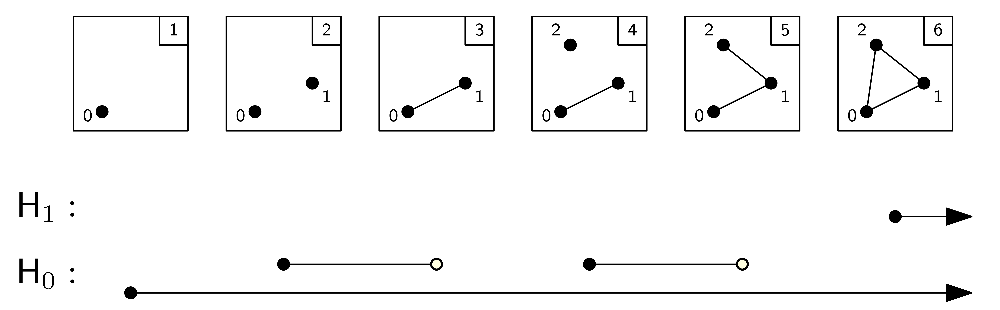

- inspired by my colleague Nikki Sanderson's work with Professors Meiss and Bradley
- she just defended her PhD, titled *Topological Data Analyses of Time Series Using Witness Complexes*

## Introduction

- In this talk, we apply TDA to the question "is depth needed for deep learning?"

    - as most of you probably know, the word "deep" has become very very popular in machine learning over the last few years, due to the dramatic resurgence of multi-layer neural networks

    - an informal argument for why they're so good, atleast in terms of their expressiveness, is that they can compactly represent very complex nonlinear predictors, for instance in the context of vision, one might have a multilayer network that computes relatively simple features, like edges, then on deeper nodes more sophisticated features, like faces and cats

    - well, this is just a hand-waving argument: can we formalize it? in some sense, we already have.
    
    - since Cybenko in 1989 we know that any continuous function on a bounded domain in $\mathrm{R}^d$ can be accurately approximated by a $2$-layer network that's sufficiently large

    - the catch is that to get this approximation, we have to use networks that are exponentially large in the dimension $d$
    
    - the model selection problem is posed as so: given a limited number of hidden units, how can we determine the optimal width and depth of a network?

- Guss and Salakhutdinov's main contribution to answer is empirical

- For each architecture in a catalog of neural nets of varying width and depth, Guss and Salakhutdinov trained $100$ instances on $930$ synthetic data sets of varying topological complexity, reporting out the minimum and average error versus the number of minibatches seen during training.

- Guss conjectures that the complexity of a dataset strictly limits the *expressivity* of a neural architecture. 

- **The goal of this talk is to make this characterization more precise.**

### depth vs width

- Guss presents evidence that the capacity of a feed-forward neural network to accurately approximate the positive decision region of point-cloud a dataset depends on:

    - the *depth*, or number of hidden layers in the architecture
    - the *width*, or number of hidden units in the architecture
    - and a summary statistic of the dataset called its *persistent homology*

### what's a feed-forward neural network?

- composed of single neurons: $$\mathbf{x} \mapsto \sigma(\langle \mathbf{w}, \mathbf{x} \rangle + b), \quad \quad \mathbf{x}, \mathbf{w} \in \mathbf{R}^d,\quad b \in \mathbf{R}.$$

    - computes some linear transformation of the vector
    - then pushes it through some nonlinearity, 
        - could be a sigmoid, could be a ReLu: $z \mapsto \max\{0,z\}$.
    - they're arranged in layers: we'll assume a single output neuron

- depth $2$ width $n$ network: $$\mathbf{x} \mapsto \sum_{i=1}^n v_i \sigma(\langle \mathbf{w}_i, \mathbf{x} \rangle + b_i)$$

- depth $3$ width $n$ network: $$\mathbf{x} \mapsto \sum_{i=1}^n u_i \sigma\left(\sum_{j=1}^n v_i \sigma(\langle \mathbf{w}_{i,j}, \mathbf{x} \rangle + b_{i,j}) + c_i\right)$$

## Problem: Model Selection

### motivating question

From cross validated in 2010: is there a standard method for calculating the number of layers, and the number of nodes in each layer, in a feed-forward neural network?

- Hyndman's goal: automated generation of neural networks. 
- Our goal: understand the search space.
    - how to choose hyperparameters depth and width?

### figure: two choices for the width of the first hidden layer, four panels

- good to fix in one's mind: failure modes
- consider the positive decision region of a classifier
- both $2$-layer neural networks, this issue more sophistically considered in Guss 2018
- the network with 12 hidden units cannot express the holes in the second dataset $\mathcal{D}_2$
- a network 26 hidden units can indeed

###  plausible approaches 

State of the art in 2009

- trial and error
- heuristic search
    - not often *scalable*
    - usually hard won
- exhaustive search
    - not *computationally feasible* if the search needs to be repeated
    - idea: create a catalog

We'll look at two styles of search to answer the model selection problem.

### first example: heuristic search (Eldan and Shamir in 2016)

(Informally) Is there a function $g \colon \RR^d \to \RR$ that

- **is expressible** by a network with $\ell$-layers and $w$ neurons per layer,
- **yet cannot be well-approximated** by any network with $\tilde{\ell} < \ell$ layers, unless the width $\tilde{w}$ is allowed to be very large?

Such a function is said to give a *depth separation*.

We know there *is* a depth separation between $2$ and $3$ layer networks, because Eldan constructed an approximately radial simple function from $\RR^d$ to $\RR$ with the property:

> $3$-layer networks of width $w \in O(d^k)$ polynomial in the dimension $d$ can arbitrarily approximate such a radial function, but $2$-layer networks cannot, unless the $2$-layer networks have width $\tilde{w} \in O(k^d)$ exponential in $d$.

Say we're training an architecture to distinguish decision regions with radial or periodic boundaries: we might then require atleast $3$ layers to keep the number of hidden units down to a reasonable size for accurate approximations.

We say this search is *heuristic*, because the result comes with great effort. (Aside: a familiar classification of circuit complexity was accomplished in the early 90s, but here we're dealing with continuously valued functions.)

### exhaustive search: Guss's paper!

We'll just line up a series of computations to get empirical insight about the search space. This is Guss's method of approach.

For each $\ell \in \{1, \ldots, 6\}$ and $h_0 \in \{1,\ldots, 500\}$, consider the architecture $(\ell, h_0)$ given by

- $\ell$ layers and $h_0$ neurons in the first hidden layer
- a constant width $\beta_0(\mathcal{D})$ after first layer
- $2$ input neurons, $1$ output neuron (e.g., $f \colon I^2 \to I$ where $I = [0,1] \subset \mathrm{R}$)
- unit weights initialized from a normal distribution $\mathcal{N}(0, 1/\beta_0(\mathcal{D}))$
- rectified linear (ReLu) activation functions.
    
For each $\mathcal{D}$ of $930$ synthetic distributions (with cts. CDFs) over $I^2 \times \{0, 1\}$, to train architecture $(\ell, h_0)$:

- take $100$ initialized instances of the architecture $(\ell, h_0)$
- sample the distribution $\mathcal{D}$ $5000$ times: obtain a finite point cloud $P \subset I^2$
- optimize the architecture $f$ for binary classification by minimizing cross-entropy loss ($\star$)
    - *we want* $f(P) = 1$ and $f(I^2 \setminus P) = 0$
- use adaptive moment estimation, a fixed learning rate, and increasing batch size ($\star$).

### how such distributions are chosen

$\mathcal{D}$  is one of $930$ different distributions given by

- mixtures of balls $\mathrm{Unif}(B^2)$ and circles $\mathrm{Unif}(\mathbb{S}^1)$ 
- with homological complexity  $(\ZZ^1, \{0\})$ continguously up to $(\ZZ^{30}, \ZZ^{30})$
    - now, the dimension of each vector space over the integers indicates that the synthetic distribution has 
        - $1$ components and no holes
        - all the way up to $30$ components and $30$ holes

### how training error is measured

Guss relies on two error measures: one for training, and one for the architecture after training. They ask:

1. What is minimum misclassification error against number of minibatches seen as a *family of architectures* are trained on a specific synthetic dataset?
2. At the end of training, does the positive decision region of a trained architecture expresses the homological complexity of the underlying distribution?

To demonstrate the first measure, consider the percent misclassification error for $1$-layer (left) vs $2$-layer (right) architectures here.

## Key Idea: Consider Homological Complexity

### convergence wrt homological complexity

consider one vertical band: representing a $1$-layer architecture, say with a width of $10$. On a dataset with homological complexity $(2,0)$, we only need around $3000$ iterations of training to bring the minimum misclassification error under $5\%$. The same architecture trained on a dataset of homological complexity 

- $(3,0)$, needs $10,000$ iterations,
- $(4,0)$, needs $20,000$ iterations, 
- and so on

### road map

- Guss and Salakhutdinov (among many others) apply *persistent homology* as a scale-free method for computing a *barcode* of Betti numbers from a point cloud dataset
    - it's like an imperfect fourier transform
    - the point cloud is like the signal in the time-domain, 
    - the topological *barcode* is like the decomposition in the frequency domain

- to define persistent homology, we'll first define *homology*
    - by the way, we'll have defined Betti numbers, that measure the rank of algebraic structures associated to topological spaces
        - *Betti numbers* serve as the indices for Guss's synthetic datasets

### zooming in

### homology 

> In its most primal manifestation, the homology of a space $X$ returns a sequence of vector spaces $H_\circ(X)$, the dimensions of which count various types of linearly independent holes in $X$. <cite data-cite="6503695/29DHXJ9A"></cite>

- the historical champion here is the *homology* functor,
- meant originally to classify manifolds by considering cycles of different dimensions in the manifold
    - these cycles are associated to *cycle* groups, from which we obtain a sequence of *vector spaces*
    - once the space is triangulated, the cycles look a bit like lichtenberg wood art
        - electric etchings on a surface, but also defined for higher dimensions

### it's combinatorial!

We describe cycles as chains of simplices:

For dimensions $-1$ upto $3$, our simplices are

- the empty set
- a vertex
- an edge
- a triangle
- a tetrahedron

### approximate the space $X$ with a simplicial complex

Now all smooth manifolds admit a homeomorphic "triangulation" into simplices. For other topological spaces, such a decomposition isn't guaranteed.

For instance, a point cloud could be naively decomposed into a set of $N$ vertices, but such a simplicial complex is not helpful for analysis if we know about the pairwise distances of points in the space.

The software Ripser uses a slick decomposition called the *Vietoris-Rips* complex, where two vertices are connected by an edge if they're pairwise within $\epsilon$ of eachother.

### a simplicial complex defines a chain complex of groups

Formally, we're cataloging how cells of higher dimension fit together with cells of one lower dimension
 
- begin with a chain group $\mathsf{C}_p$, whose elements are formal sums of the $p$-dimensional cells
- the boundary homomorphism $\delta_p \colon \mathsf{C}_p \to \mathsf{C}_{p-1}$ maps each $p$-chain to the sum of the $p-1$ dimensional faces of its $p$-cells
- for an $n$ dimensional simplicial complex $X$, we have a sequence of homomorphisms linking the chain groups, called the *chain complex* $$0 \xrightarrow{\delta_{n+1}} \mathsf{C}_{n} \xrightarrow{\delta_{n}} \mathsf{C}_{n-1} \xrightarrow{\delta_{n-1}} \cdots \xrightarrow{\delta_{2}} \mathsf{C}_{1} \xrightarrow{\delta_{1}} \mathsf{C}_0 \xrightarrow{\delta_{0}} 0.$$

Like with graphs, where one has adjacency matrices recording how edges and vertices fit together, so also, each cell complex has an associated matrix recording how:

- triangles touch the $3$ edges in their boundary
- tetrahedra touch the $4$ triangles in their boundary
- and so on

For each transition from simplex to boundary, we obtain a matrix.

0. edges to vertices
1. triangles to edges
2. tetrahedra to triangles
3. and so on

At the edges to vertices stage, this matrix is exactly the adjacency matrix, but higher matrices quickly become more abstract. 

### kernels and images

What does one do when they have a matrix? (Not necessarily square.)

- compute column and null spaces
- these correspond to boundary and cycle groups

- we know when a $p$-chain is a $p$-cycle because it has no boundary: it's in the null space of boundary matrix
- a $p$-boundary is simply a $p$-chain in the image of the previous boundary homomorphism.

- now the boundary group of dimension $p+1$ is a subgroup of the cycle group of dimension $p$, 
- the quotient group is called the $n^{th}$ homology group: it's an abelian group

    - *we're taking equivalence classes of $p$-cycles*
    - under the *homologous* equivalence relation 
        - two $p$-cycles are *homologous* if they differ by a boundary. 

(E.g., the red $1$-cycles are homologous.)

### Betti numbers

- the quotient group is called the $p^{th}$ homology group: it's an abelian group
- the rank of each dimension's homology group produce the invariants we desire: Betti numbers for each dimension $p$, measuring the number of generators for $p$-cycles
- Betti numbers of different $p$ homology groups serve as a measure of components, tunnels, voids, etc

### point cloud $\to$ nested complexes $\to$ persistence module

The main steps in persistent homology analysis are as follows. 

- We treat each data point as a node in a graph, drawing edges between nearby nodes where nearby is according to a scale parameter. 
- We form complexes from the simplices formed by the nodes and edges, and examine the topology of the complexes as a function of the scale parameter. 
- The topological features such as connected components, and holes of various dimensions that persist across scales are the ones that capture the underlying shape of the dataset.

In greater detail:

### persistent homology should be scale-free

We make a minimal interpretation of the point cloud.

We'll only need single linkage clustering.

- no model, no probability
- just pairwise distances
- familiar idea: points in a metric space

From the point cloud, we build a filtered cell complex (think about the construction parameterized by a time $t$).

The easiest version:

- $0$ and $1$ cells are just vertices and edges
- at some time near zero, we've constructed a weighed graph where the edges are labelled with pairwise distances between points

What happens in higher order interactions? We add higher dimensional connections, a little more abstract, sufficient for computation:

Say at some time, $3$ vertices can be fit within a ball of radius $5$. Then we add a $2$-cell, a triangle, filling in the edges of the $1$-cell skeleton.

### filtrations create nested complexes

- We can break the filtration into chunks to add on sequentially.
- this provides some computational efficiency
    - Just an *ordering* of simplices.

```
simplices = [([0], 1), ([1], 2), ([0,1], 3), ([2], 4), ([1,2], 5), ([0,2], 6)]
f = Filtration()
for vertices, time in simplices:
    f.append(Simplex(vertices, time))
```

### persistence of a homology class: the length of the interval that supports it

These are the points in time (considering $\epsilon$ increasing with time) at which a generator for the $p$th homology group comes into existence and becomes indistinguishable, respectively



### barcodes: how homology classes persist over time

Each complex in the filtration has an associated homology. The *persistent homology* of a dataset is then best represented a barcode, with bars corresponding to the births and deaths.

### example: point cloud unit cube vs point cloud on the sphere

TDAstats package for R, calls *Ripser*, which is fast for computing the filtrations 

- notice how the sphere has a nontrivial $2$nd homology group, generated by one element.
- such a "void" is squashed by eps-balls in the point cloud generated uniformly *inside* the unit cube

## results: topological phase transitions

Our goal in this section is to make plausible Guss's conjecture that there's a lower bound on the number of hidden units in the first layer required to accurately approximate a positive decision region.

### first measurement: misclassification error vs minibatches seen

We'll vary the number of hidden layers for architectures trained on a dataset of certain homological complexity:

> - On the upper right corner of each plot is a dataset on which the neural networks of increasing first layer hidden dimension are trained
> - Each plot gives minimum error for each architecture versus the number of minibatches seen 

- consider 3 vs 4 layers on $(Z^2, Z^1, 0, \ldots)$
    - $3$-layer networks don't reach small error unless the width of the first layer is greater than $4$!
    - notice in $4$-layer networks these minimal misclassification errors are knocked down
- then 3 vs 4 layers on $(Z^4, Z^2, 0, \ldots)$
    - Guss argues that networks exhibit a statistically significant *topological phase transition* during learning which depends directly on the homological complexity of the data
    - the best error on architectures with $\ell$ layers and $h$ hidden units is *strictly limited* in magnitude and convergence time by a some *phase width*

### second measurement: homological expressivity at end of training

We need a final definition: let $\beta_p(\mathcal{D})$ and $\beta_p(f)$ denote the $p$th Betti numbers of the dataset $H(\mathcal{D})$ and the positive decision region $H_S(f)$ respectively.

Then the error at the end of training is given by the ratio:

$$E_H^p(f, \mathcal{D}) = \min\left\{\frac{\beta_p(f)}{\beta_p(\mathcal{D})}, 1\right\}.$$

### formally

- $H(\mathcal{D})$ denotes the homology of $X^+$
    - $\mathcal{D}$ is drawn from a joint distribution on $X \times \{0,1\}$
    - $X^+$ is the support of the distribution of points with positive labels
    
- $H_S(f)$ denotes the support homology of the subspace $\{x : \tilde{f}(x) = 1\} \subset X$ 
    - for $\tilde{f} \colon X \to \{0,1\}$ defined as a Heaviside function 
    - $\tilde{f}(x) = \begin{cases} 1 & \text{ if } f(x) > \frac{1}{2}\\ 0, & \text{ else}\end{cases}$

> Given a dataset $\mathcal{D}$, for which architecture $A$ does there exist a neural network $f \in \mathcal{F}_A$ such that $H_S(f) = H(\mathcal{D})$? 

### probability plots

Returning to the initial question of architecture selection, we'll make an empirical estimation of the homological error $E_H^p(f, \mathcal{D})$. 

For architectures with depth $1$ to $4$ and first hidden layer width $1$ to $30$, this plot shows the estimated probability that $(\ell, h_0)$ expresses the homology of the positive label support after training.

For $\ell = 1$, clearly the maximal expressivity for $f$ in terms of $\beta_0$ is of order $h_0$. 

### conjecture: lower bound estimate for $h_\mathrm{phase}$

Empirically, as $\ell$ increases, 
$$\max_{f \in \mathcal{F}_A} \beta_0(f) \in \mathcal{O}(h_0^\ell)$$ 
therefore
$$h_\mathrm{phase} \ge C\sqrt[\ell]{\beta_0(\mathcal{D})}.$$
Considering dependence on $\beta_1$, guess
$$\hat{h}_\mathrm{phase} ( \beta_0, \beta_1) \ge \beta_1 C \sqrt[\ell]{\beta_1} + 2.$$

### Further directions

- Guss 2018 approaches the problem as standard TDA on separate classes
    - rather than trying to characterize the topology of the decision boundaries
    
- new techniques and constructions for characterizing decision boundaries
    - in rebuttal, Ramamurthy Varshney and Mody 2018 propose studying *labelled Čech complexes*
    - `github.com/nrkarthikeyan/topology-decision-boundaries`

### Summary

> Choosing an architecture whose homological complexity matches that of the dataset, generalizes well. 

## References

- [“The Power of Depth for Feedforward Neural Networks - YouTube”](https://www.youtube.com/watch?v=Ue_hR6x0B-U). Retrieved November 27, 2018.

- [“Dr Vidit Nanda, University of Oxford - YouTube”](https://www.youtube.com/watch?v=JqajfI4-WnM). Retrieved November 27, 2018.
